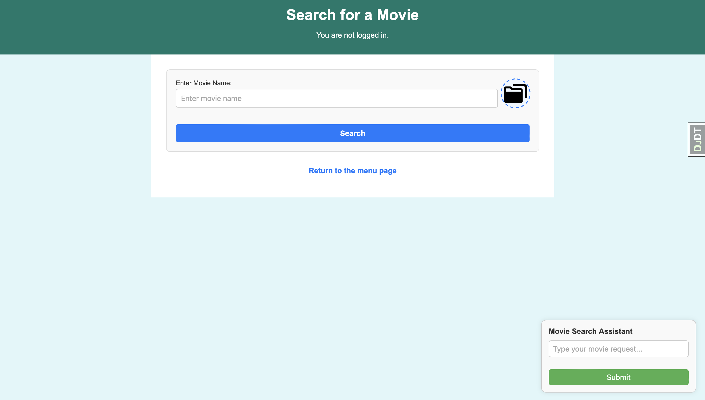
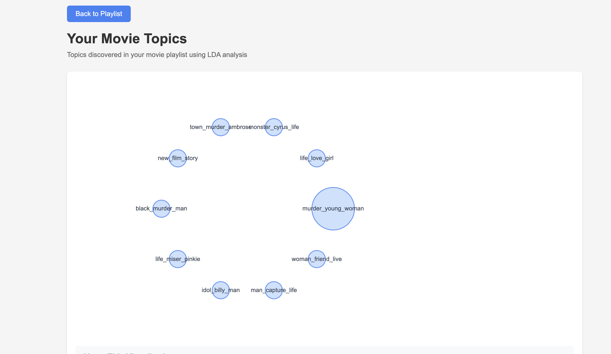

# Movie Search and Recommendation System

## Abstract
This is a Django web app that allows user searching for their favorite movies.
Also, for each selected movie system will provide up to 10 recommendations.

Additionally, user can create their own playlists and based on movies in playlist they will get 3 recommendations per movie.
Finally, user may view recommendations based on all movies in all their playlist (this is the most time-consuming part)

Right now database, which is PostgresSQL, contains around 25k movies and related information.



## Data

We used movies data from Kaggle:

```
https://www.kaggle.com/datasets/rounakbanik/the-movies-dataset
```

Posters image data:

```
https://www.kaggle.com/datasets/neha1703/movie-genre-from-its-poster?select=MovieGenre.csv
```


PostgresSQL is used to store it.

## Methodology

### Search

1) We use PostgresSQL to store the data
2) Users have 3 ways to search for a movie.

   1) By title. System will use PostgresSQL full text search to look for the best match based on a title.
   2) In a natural language by using custom chat box. For that we store text embeddings of each movie in ChromaDB client.
   3) By movie poster. For that we store image embeddings of each movie poster in ChromaDB client.

    The most accurate way is #1.

### Recommendations

1) Our system produces content based recommendations. It means it will recommend movies only based on the choice of previosuly selected movies.
2) We use a combination of cosine similarity and XGB ranker.
   1) For each movie we use cosine similarity to look for k closes movies.
   2) Then, for each closest, if user is logged in, we use trained XGB ranker to rank movies based on the user ratings
   3) If user is not logged in we output 10 from k closest from step 1, else we output 10 from the ranked movies from step 2


### Embeddings Storage

1) To store Embeddings (that allow image/natural language search) efficiently we use chroma db client for that.


### Redis

1) We use Redis to cache the results from different searches/recommendations.
2) We use Reddis as a Celery broker
3) We use Reddis to store the precomputed recommendations


### LDA (integrating...)

1) We use LDA to analyze the topics of users movies (per user playlist) and display topics to user



### Celery (integrating...)

1) Recommendation computation is quite time-consuming. We use celery to schedule a background task that re-trains XGB and computes recommendations for each user
2) We store recommendations in Reddis. Then, when user wants to see their recommendations, we just retrieve info from Reddis.
3) LDA training/output procedure should also be configured for Celery worker.


## Project Set Up

You can clone rep from GitHub:

```
git clone https://github.com/Maestro-111/movies-search-system.git
cd movies-search-system
```


## Docker Set up

It's convenient to use docker to  get all packages/dependencies set up together.

1) Create a docker compose:

```
docker compose build
docker compose up
```

2) Run migrations within web container

```
cd movies
python manage.py makemigrations
python manage.py migrate
```

3) Populate PostgresSQL (this will take a while...)

```
cd ..
cd populate_databse
python main.py

```

4) Create Embeddings for both images/text data

```
cd ..
python generate_text_embeddings.py
python generate_image_embeddings.py
```


## TO DO

1. Updating Forum Section.
2. front-end (cont)
3. Fix .dockerignore issue (e.g. not ignoring sqlite files)
4. Continue updating friends section within users. Final goal is to have more info for recommendations
5. Imporve the ranker
6. LDA
   1. Update/decompose code to train (LDA)
   2. Now LDA is for all movies. What about LDA for each playlist?
   3. Similar - what about show function for each playlist?
