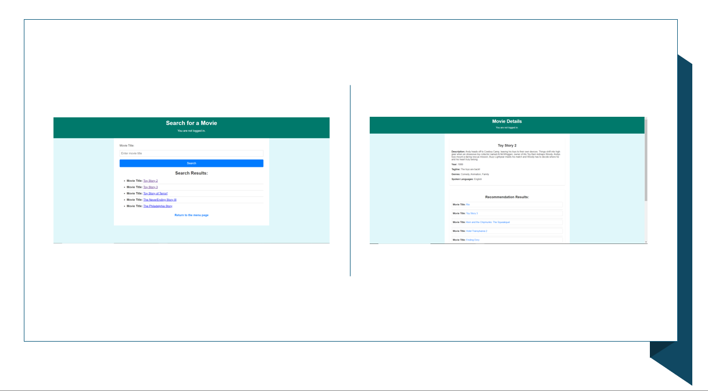

# Search and Recommendation System with Django

## Abstract
This is a Django web app that allows user searching for their favorite movies.
Also, for each movie system will provide up to 10 recommendations. 
Right now database, which is SQLite, contains around 25k movies. 

## Set Up
Currently, set up for this project is not supported

## TO DO
1. Resolve issue when user does not have playlist and want to add a movie.
2. Add recommendations for each user based on selected movies in playlists.
3. Add set up instructions and data.

